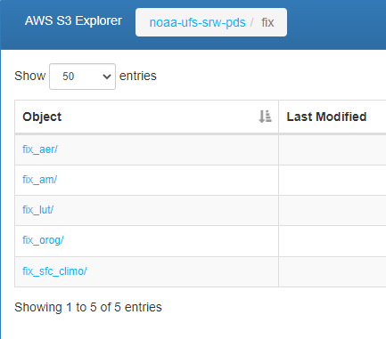
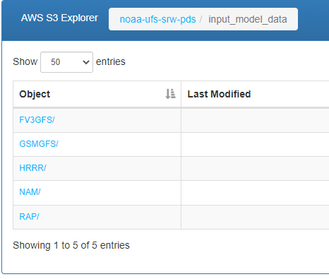

<h1 align="center">
Data Uploader for 
    UFS SRW Application Datasets to Cloud Data Storage
</h1>

    
    

<h5 align="center">
    
[Prerequisites](#Prerequisites) • [Dataset](#Dataset) • [Quick Start](#Quick-Start) • [Environment Setup](#Environment-Setup) • [Status](#Status)
 • [What's Included](#What's-Included) • [Documentation](#Documentation) • [References](#Reference(s))

</h5>

# About

__Purpose:__

The purpose of this program is to transfer the Unified Forecast Sytstem Short-Range Weather Application (UFS SRW Application) fixed and input model datasets residing within the RDHPCS to cloud data storage via chaining API calls to communicate with its cloud data storage bucket. The program will support the data required for the current UFS SRW Application.

According to Amazon AWS, the following conditions need to be considered when transferring data to cloud data storage:

* Largest object that can be uploaded in a single PUT is 5 GB.
* Individual Amazon S3 objects can range in size from a minimum of 0 bytes to a maximum of 5 TB.
* For objects larger than 100 MB, Amazon recommends using the Multipart Upload capability.
* The total volume of data in a cloud data storage bucket are unlimited.

Tools which could be be utilized to perform data transferring & partitioning (Multipart Upload/Download) are:

* AWS SDK
* AWS CLI
* AWS S3 REST API

In this demontration, the framework will implement Python AWS SDK for transferring the UFS SRW application fixed and input model datasets from the RDHPCS, Orion, to the cloud data storage with low latency. 

The AWS SDK will be implemented for the following reasons:
To integrate with other python scripts.
AWS SDK carries addition capabilities/features for data manipulation & transferring compare to the aforementioned alternate tools.

__Capabilities:__

The framework will be able to perform the following actions:

Multi-threading & partitioning to the datasets to assist in the optimization in uploading performance of the datasets from on-prem to cloud. 

__Future Capabilities:__

User can request the SRW datasets that is applicable to their SRW release version needs -- rather than the full datasets within the SRW tar folders as SRW development continues within this project program in the future.

# Table of Contents
* [Prerequisites](#Prerequisites)
* [Dataset](#Dataset)
* [Quick Start](#Quick-Start)
* [Environment Setup](#Environment-Setup)
* [Status](#Status)
* [What's Included](#What's-Included)
* [Documentation](#Documentation)
* [References](#Reference(s))

# Prerequisites
* Python 3.9
* Setting up AWS CLI configurations for uploading to Cloud.
* Setting up conda environment w/in RDHPCS.
    * Refer to [Environment Setup](#Environment-Setup)

# Dataset
* N/A

# Quick Start
* For demonstration purposes, refer to '.ipynb'

# Environment Setup:
Install miniconda on your machine. Note: Miniconda is a smaller version of Anaconda that only includes conda along with a small set of necessary and useful packages. With Miniconda, you can install only what you need, without all the extra packages that Anaconda comes packaged with:
Download latest Miniconda (e.g. 3.9 version):

wget https://repo.anaconda.com/miniconda/Miniconda3-py39_4.9.2-Linux-x86_64.sh
Check integrity downloaded file with SHA-256:

sha256sum Miniconda3-py39_4.9.2-Linux-x86_64.sh
Reference SHA256 hash in following link: https://docs.conda.io/en/latest/miniconda.html

## Install Miniconda in Linux:

bash Miniconda3-py39_4.9.2-Linux-x86_64.sh
Next, Miniconda installer will prompt where do you want to install Miniconda. Press ENTER to accept the default install location i.e. your $HOME directory. If you don't want to install in the default location, press CTRL+C to cancel the installation or mention an alternate installation directory. If you've chosen the default location, the installer will display “PREFIX=/var/home//miniconda3” and continue the installation.

For installation to take into effect, run the following command:

source ~/.bashrc
Next, you will see the prefix (base) in front of your terminal/shell prompt. Indicating the conda's base environment is activated.

Once you have conda installed on your machine, perform the following to create a conda environment:
To create a new environment (if a YAML file is not provided)

conda create -n [Name of your conda environment you wish to create]
(OR)

To ensure you are running Python 3.9:

conda create -n myenv Python=3.9
(OR)

To create a new environment from an existing YAML file (if a YAML file is provided):

conda env create -f environment.yml
*Note: A .yml file is a text file that contains a list of dependencies, which channels a list for installing dependencies for the given conda environment. For the code to utilize the dependencies, you will need to be in the directory where the environment.yml file lives.

## Activate the new environment via:
conda activate [Name of your conda environment you wish to activate]
Verify that the new environment was installed correctly via:
conda info --env
*Note:

From this point on, must activate conda environment prior to .py script(s) or jupyter notebooks execution using the following command: conda activate
To deactivate a conda environment:
conda deactivate

## Link Home Directory to Dataset Location on RDHPCS Platform
Unfortunately, there is no way to navigate to the /work/ filesystem from within the Jupyter interface. The best way to workaround is to create a symbolic link in your home folder that will take you to the /work/ filesystem. Run the following command from a linux terminal on Orion to create the link:

ln -s /work /home/[Your user account name]/work
Now, when you navigate to the /home/[Your user account name]/work directory in Jupyter, it will take you to the /work folder. Allowing you to obtain any data residing within the /work filesystem that you have permission to access from Jupyter. This same procedure will work for any filesystem available from the root directory.

*Note: On Orion, user must sym link from their home directory to the main directory containing the datasets of interest.

Open & Run Data Analytics Tool on Jupyter Notebook
Open OnDemand has a built-in file explorer and file transfer application available directly from its dashboard via ...
Login to https://orion-ood.hpc.msstate.edu/
In the Open OnDemand Interface, select Interactive Apps > Jupyter Notbook
Set the following configurations to run Jupyter:
Additonal Information
To create a .yml file, execute the following commands:

## Activate the environment to export:

conda activate myenv
Export your active environment to a new file:

conda env export > [ENVIRONMENT FILENAME].yml

# Status

# What's Included
Within the download, you will find the following directories and files:
* Demo:
    * data_xfer2cloud_scripts_demo.ipynb
* Scripts:
    * transfer_srw_data.py 
        * Main executable script for uploading the full SRW datasets residing on-prem to cloud
     * upload_data.py
        * Uploader for the UFS SRW Application via AWS SDK
    * progress_bar.py
        * Monitors uploading progress of datasets to cloud  
    * read_srw_we2e_cases.py
        * Reads the SRW cases specified in  WE2E Cases and Locations.xlsx
    * WE2E Cases and Locations.xlsx
        * Excel file comprised of the list of cases requested by a given SRW user   

* List of Dependencies: 
    * cloud_xfer_env.yml

# Documentation
* Refer to srw_data_xfer2cloud_scripts_demo.ipynb

# Version:
* Draft as of 05/04/22
